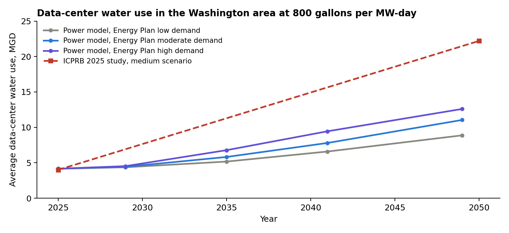
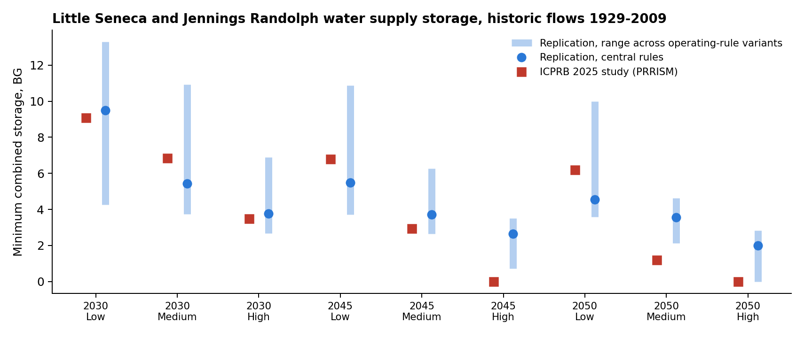
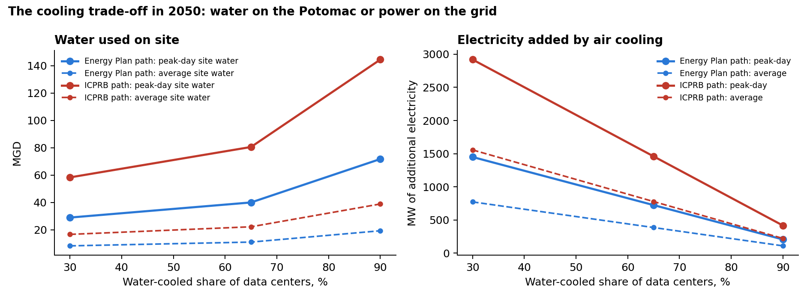

# Data Centers, Power and Water in the Potomac Basin

*A replication draft for discussion. Mamadou Seck, PhD. October 2026.*

## Purpose

This draft is an independent attempt to reproduce parts of ICPRB's *2025 Washington Metropolitan Area Water Supply Study*, and to connect it with a model of the power system that serves the region's data centers. It has three parts. The first compares the study's data-center water projections with projections derived from a power-system model. The second reproduces the study's reliability results for the historic-flow scenarios with a simple rule-based simulation. The third illustrates one question that a coupled view of power and water can address: the trade-off between cooling with water and cooling with electricity.

The work is preliminary. Every input taken from the study is identified, and every approximation is stated. The aim is to learn where the replication departs from the study, and why.

## 1. Data-center water demand

The study estimates data-center water use by multiplying effective power demand by a water use per unit of power (WUP). In its medium scenario, WUP is about 800 gallons per MW per day on average and 2,900 on peak days. Growth in power demand follows PJM load forecasts for the Dominion and Allegheny zones.

A power-system model of the Dominion zone, developed separately, gives an independent estimate of data-center power demand in Northern Virginia. That model was calibrated to observed 2025 generation and used to replicate the Virginia Energy Plan.

**The starting points agree.** At 800 gallons per MW-day, the study's 4.0 MGD in 2025 implies about 5.0 GW of effective power. The power model has about 5.2 GW of data-center load in Northern Virginia in 2025.

**The growth paths differ by about a factor of two** (Figure 1). Under the Energy Plan's demand growth rates, data-center power in Northern Virginia grows 2.1 to 3.0 times by 2049. At the study's medium WUP, average water use reaches 9 to 13 MGD. The study's medium scenario reaches 22.2 MGD in 2050, a growth of about 5.5 times.

*Figure 1. Average data-center water use in the Washington area, applying the study's medium WUP to the power model's paths, compared with the study's medium scenario.*

Two factors explain the gap. First, the two projections rest on different growth assumptions. The study uses PJM's forecast, in which Dominion load rises from 23,000 to 54,000 MW. The power model uses the state Energy Plan's demand growth rates, which are considerably lower. Second, in the power model not all data-center growth locates in Northern Virginia. The limited capacity to deliver power into the region shifts about a fifth of new data-center load elsewhere in the Dominion zone, outside the Potomac basin. In that model, water demand in the basin is partly determined by the power grid.

One point in the report may deserve a check. Section 6.2 describes the growth of Dominion's data-center electricity use as 2.7-fold. That figure equals the ratio of the projected shares (68 percent over 25 percent). The ratio of the loads would be about 6.4-fold. The study's WMA results grow about 5.5-fold, which suggests the computation used load-based growth and the 2.7 figure is a description issue only.

## 2. Replicating the historic-flow scenarios

### Approach

The replication simulates the WMA system day by day, following the operating logic described in Chapter 5 of the study. It covers the nine scenarios that use the unaltered historic flow record (Tables A.4-1 to A.4-9): the years 2030, 2045 and 2050, each with low, medium and high demand.

Taken directly from the study:
- annual WMA demand for each scenario (Tables A.4-1 to A.4-9) and monthly demand factors (Table 4-3);
- monthly upstream consumptive use and its growth (Table 6-4), plus upstream data-center use (Tables A.3-1 and A.3-2);
- wastewater returns above Little Falls and to the Occoquan (Table 5-2);
- usable reservoir capacities by year (Table 5-1) and planned resources (Table 5-6);
- plant capacities, minimum flows and the 100 MGD flow-by at Little Falls (Table 5-5);
- restriction triggers and demand reductions (Table 5-4);
- the structure of operations: North Branch releases decided nine days ahead from a recession forecast, and Little Seneca releases and Fairfax Water load shifts one day ahead (Section 5.3.3).

Approximated:
- natural flow at Little Falls is the USGS adjusted series (site 01646502), with October 1929 to February 1930 filled from Point of Rocks (site 01638500);
- inflows to Jennings Randolph, Little Seneca, the Patuxent reservoirs and the Occoquan are scaled from the Little Falls flow by drainage area;
- the nine-day forecast uses a constant daily recession fitted to drought baseflow (0.963 per day), in place of the equation in Ahmed et al. (2015);
- load shifts to the Occoquan and Patuxent follow simple rules: a fixed increase when the Potomac alone cannot meet demand, within plant limits and storage thresholds;
- Milestone Reservoir and the Vulcan Quarry supply limited amounts during stress and refill at the rates described in Table 5-6;
- the Jennings Randolph water quality account and Savage Reservoir are not represented.

### Results

Figure 2 compares the minimum combined storage in Little Seneca and Jennings Randolph over the 1929-2009 record with the study's values.

*Figure 2. Minimum combined water supply storage in Little Seneca and Jennings Randolph reservoirs. The bars show the range across four variants of the approximated operating rules.*

The replication matches the 2030 scenarios closely. It reproduces the decline of minimum storage as demand rises and as the scenario year moves later. It is too optimistic for the most stressed cases. In 2045 and 2050 with high demand, the study empties the reservoirs and records deficits, while the central replication keeps about 2 to 2.6 billion gallons.

The results are highly sensitive to two operating details that the report does not fully specify:

| Variant | Effect on minimum storage |
|:--|:--|
| Slightly slower recession in the nine-day forecast (0.975 per day) | Adds about 1 to 5 BG, most at low and medium demand |
| Load shifts to the Occoquan and Patuxent halved | Lowers storage by up to 2.5 BG at low demand, less at high demand |
| No load shifts | Reproduces the high-demand failures, but is far too pessimistic at low demand |

No single setting matches all nine scenarios. The pattern suggests that the study's load shifting is generous when storage is ample and constrained during severe, prolonged stress, probably through Occoquan and Patuxent storage triggers that the simple rules here do not capture.

## 3. A coupled view: the cooling trade-off

Data centers remove heat either with water, through evaporative cooling, or with electricity, through air-cooled chillers. The study's three water-use scenarios differ in the share of water-cooled facilities: 30 percent, about 65 percent and 90 percent (Table 6-5). The same choice changes electricity use. That part of the trade-off falls outside a water study, but it matters for the region.

Figure 3 shows both sides for 2050, using the study's WUP values and two assumptions: air cooling uses about 8 percent more power than water cooling on average and 15 percent more on hot peak days; and the additional power comes from a gas combined-cycle plant, which consumes about 200 gallons of water and emits about 0.4 tons of CO2 per MWh.

*Figure 3. Water used on site and electricity added by air cooling in 2050, as functions of the water-cooled share, under the power model's path and the study's path.*

Under the study's growth path, moving from 90 to 30 percent water-cooled facilities reduces peak-day site water use from about 145 to 58 MGD. It adds about 1,300 MW of average electricity demand and 2,500 MW on peak days. It adds about 6 MGD of water consumption at power plants, much of it outside the basin, and about 4.7 million tons of CO2 a year. Peak cooling demand for both water and power falls on the hottest days, when river flows are often lowest and the grid is most stressed.

The cooling choice also affects reliability during a drought. Adding data-center use beyond the 2025 level to the replication for 2050 with medium demand lowers minimum storage from 3.56 BG to 3.04 BG with 30 percent water cooling, and to 2.50 BG with 90 percent, under the study's growth path. These effects are modest compared with the role of operating rules, but they are not negligible compared with the margins in the stressed scenarios.

The point of the illustration is not the specific numbers, which rest on stated assumptions. It is that water savings from air cooling move part of the burden to the power system. A coupled model can show where that burden lands and when.

## Questions for CO-OP

1. Is the nine-day recession equation from Ahmed et al. (2015) available, or could it be shared?
2. What rules govern load shifts to the Occoquan and Patuxent in PRRISM, including storage triggers and maximum rates?
3. How are Milestone Reservoir and the Vulcan Quarry operated in the simulations?
4. Are the natural flow series used by PRRISM available, including inflows to Jennings Randolph, Little Seneca, the Patuxent reservoirs and the Occoquan?
5. How are the Jennings Randolph water quality account and Savage Reservoir represented in drought operations?
6. Could the 2.7-fold growth figure in Section 6.2 be confirmed?
7. Would a coupled analysis of cooling choices and power demand be useful to CO-OP's future work?

## Limitations and next steps

The replication is a draft. It uses approximations for tributary inflows, the flow forecast and the operating rules, and it omits two reservoirs. It covers only the historic-flow scenarios, not those altered for changing flows. The power-side figures rest on assumptions about the electricity penalty of air cooling and the marginal power source.

The next steps depend on the answers above. With the operating rules and inflow series, the replication could be brought much closer to the study. The same system would then be represented in Techgraph, a network model of technological change, coupled with the power system of the Dominion zone. That model would allow questions the separate studies cannot address on their own: how data-center siting responds to both water and power constraints, and how a summer that combines drought and heat affects both systems at once.

*Data: ICPRB (2025); USGS daily discharge for sites 01646502 and 01638500. Code and inputs are available on request.*
